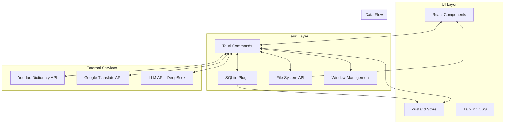
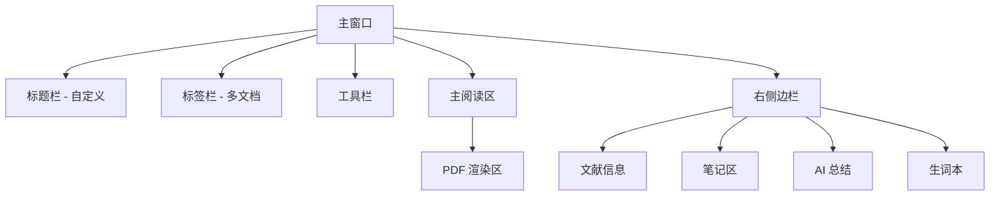

# English Reader - Technical Design Specification

## 1. Project Overview

### Project Name
English Reader (英文文献阅读器)

### Project Type
Cross-platform Desktop Application

### Core Functionality
A document reading application designed for Chinese students and researchers to efficiently read and translate English academic papers (PDF, EPUB, DOCX formats) with built-in translation, note-taking, and literature management capabilities.

### Target Users
- Chinese undergraduate and graduate students
- Academic researchers
- Professionals reading English documentation

### Technology Stack

| Layer | Technology |
|-------|------------|
| Frontend Framework | React 18 + TypeScript |
| Desktop Runtime | Tauri 2.x |
| PDF Rendering | PDF.js |
| State Management | Zustand |
| Local Database | SQLite (via Tauri SQL plugin) |
| Styling | Tailwind CSS |
| Build Tool | Vite |
| Markdown Rendering | react-markdown |

### Target Platforms
- Windows 10/11 (primary)
- macOS 12+ (secondary)

---

## 2. Architecture Design

### 2.1 Overall Architecture



### 2.2 Directory Structure

```
english-reader/
├── src/                      # React frontend source
│   ├── components/           # UI components
│   │   ├── common/           # Shared components (Button, Input, Modal)
│   │   ├── reader/           # PDF reader components
│   │   ├── library/         # Library management components
│   │   ├── notes/           # Notes and annotation components
│   │   ├── translation/      # Translation components
│   │   └── ai/               # AI summary components
│   ├── stores/               # Zustand stores
│   │   ├── documentStore.ts  # Document state
│   │   ├── libraryStore.ts   # Library state
│   │   ├── settingsStore.ts  # Settings state
│   │   └── aiStore.ts        # AI state
│   ├── hooks/                # Custom React hooks
│   ├── utils/                # Utility functions
│   ├── api/                  # API client functions
│   ├── types/                # TypeScript type definitions
│   ├── locales/              # i18n translations
│   ├── App.tsx               # Root component
│   └── main.tsx              # Entry point
├── src-tauri/                # Tauri backend source
│   ├── src/
│   │   ├── main.rs           # Tauri entry point
│   │   ├── commands/         # Tauri commands
│   │   │   ├── mod.rs
│   │   │   ├── file.rs       # File operations
│   │   │   ├── database.rs   # SQLite operations
│   │   │   ├── pdf.rs        # PDF processing
│   │   │   └── translation.rs # Translation API
│   │   └── lib.rs
│   ├── Cargo.toml            # Rust dependencies
│   └── tauri.conf.json      # Tauri configuration
├── public/                   # Static assets
├── package.json
├── vite.config.ts
├── tailwind.config.js
├── tsconfig.json
└── README.md
```

---

## 3. Component Design

### 3.1 Main Window Layout



### 3.2 Core Components

#### MainLayout
- Manages overall window layout
- Handles window controls (minimize, maximize, close)
- Provides split-screen support

#### TabBar
- Displays open documents as tabs
- Supports drag-to-reorder
- Close button on each tab
- Maximum 10 tabs

#### PDFReader
- Renders PDF using PDF.js
- Handles zoom (50%-200%)
- Smooth scrolling
- Page navigation

#### TranslationPopup
- Appears on text selection
- Shows translation result
- "Add to vocabulary" button

#### ReferencePopup
- Detects citation patterns `[1]`, `(Smith, 2020)`
- Shows hover popup with reference details

#### NotesPanel
- Markdown editor and renderer
- Auto-save every 5 seconds
- Sync with highlights

#### VocabularyBook
- List of saved words
- Export to CSV/Anki
- Review statistics

#### AISummary
- Structured paper summary
- Streaming output display
- Follow-up Q&A input

---

## 4. Data Models

### 4.1 SQLite Schema

```sql
-- Documents table
CREATE TABLE documents (
    id TEXT PRIMARY KEY,
    title TEXT NOT NULL,
    authors TEXT,
    year INTEGER,
    journal TEXT,
    file_path TEXT NOT NULL,
    file_hash TEXT NOT NULL,
    cover_image BLOB,
    created_at DATETIME DEFAULT CURRENT_TIMESTAMP,
    last_read_at DATETIME,
    last_page INTEGER DEFAULT 1,
    total_pages INTEGER DEFAULT 0,
    tags TEXT DEFAULT '[]',
    folder_id TEXT
);

-- Folders table
CREATE TABLE folders (
    id TEXT PRIMARY KEY,
    name TEXT NOT NULL,
    parent_id TEXT,
    created_at DATETIME DEFAULT CURRENT_TIMESTAMP,
    FOREIGN KEY (parent_id) REFERENCES folders(id)
);

-- Highlights table
CREATE TABLE highlights (
    id TEXT PRIMARY KEY,
    document_id TEXT NOT NULL,
    page_number INTEGER NOT NULL,
    color TEXT NOT NULL,
    content TEXT NOT NULL,
    position_x REAL,
    position_y REAL,
    position_width REAL,
    position_height REAL,
    created_at DATETIME DEFAULT CURRENT_TIMESTAMP,
    FOREIGN KEY (document_id) REFERENCES documents(id) ON DELETE CASCADE
);

-- Notes table
CREATE TABLE notes (
    id TEXT PRIMARY KEY,
    document_id TEXT NOT NULL,
    content TEXT NOT NULL,
    created_at DATETIME DEFAULT CURRENT_TIMESTAMP,
    updated_at DATETIME DEFAULT CURRENT_TIMESTAMP,
    FOREIGN KEY (document_id) REFERENCES documents(id) ON DELETE CASCADE
);

-- Annotations table
CREATE TABLE annotations (
    id TEXT PRIMARY KEY,
    document_id TEXT NOT NULL,
    page_number INTEGER NOT NULL,
    content TEXT NOT NULL,
    position_x REAL NOT NULL,
    position_y REAL NOT NULL,
    color TEXT DEFAULT '#FFEB3B',
    created_at DATETIME DEFAULT CURRENT_TIMESTAMP,
    FOREIGN KEY (document_id) REFERENCES documents(id) ON DELETE CASCADE
);

-- Vocabulary table
CREATE TABLE vocabulary (
    id TEXT PRIMARY KEY,
    word TEXT NOT NULL,
    phonetic TEXT,
    definition TEXT NOT NULL,
    example_sentence TEXT,
    document_id TEXT,
    translation TEXT,
    created_at DATETIME DEFAULT CURRENT_TIMESTAMP,
    FOREIGN KEY (document_id) REFERENCES documents(id) ON DELETE SET NULL
);

-- Settings table
CREATE TABLE settings (
    key TEXT PRIMARY KEY,
    value TEXT NOT NULL
);

-- References table (for citation pop-up)
CREATE TABLE references (
    id TEXT PRIMARY KEY,
    document_id TEXT NOT NULL,
    citation_key TEXT NOT NULL,
    full_text TEXT NOT NULL,
    FOREIGN KEY (document_id) REFERENCES documents(id) ON DELETE CASCADE
);
```

### 4.2 TypeScript Interfaces

```typescript
interface Document {
  id: string;
  title: string;
  authors: string[];
  year: number;
  journal: string;
  filePath: string;
  fileHash: string;
  coverImage?: string;
  createdAt: Date;
  lastReadAt?: Date;
  lastPage: number;
  totalPages: number;
  tags: string[];
  folderId?: string;
}

interface Highlight {
  id: string;
  documentId: string;
  pageNumber: number;
  color: 'yellow' | 'green' | 'blue' | 'pink';
  content: string;
  rect: { x: number; y: number; width: number; height: number };
  createdAt: Date;
}

interface Annotation {
  id: string;
  documentId: string;
  pageNumber: number;
  content: string;
  positionX: number;
  positionY: number;
  color: string;
  createdAt: Date;
}

interface VocabularyItem {
  id: string;
  word: string;
  phonetic?: string;
  definition: string;
  exampleSentence?: string;
  documentId?: string;
  translation?: string;
  createdAt: Date;
}

interface Note {
  id: string;
  documentId: string;
  content: string;
  createdAt: Date;
  updatedAt: Date;
}
```

---

## 5. API Integration

### 5.1 Translation API

#### Youdao Dictionary API (Primary - Free)
```
Endpoint: https://dict.youdao.com/webapi/dict/query
Method: POST
Parameters: word, lang
Response: { word, phonetic, definitions, examples }
```

#### Google Translate API (Fallback)
```
Endpoint: https://translation.googleapis.com/language/translate/v2
Method: POST
Parameters: q, source, target, key
```

### 5.2 AI Summary API

#### DeepSeek API (Primary)
```
Endpoint: https://api.deepseek.com/chat/completions
Method: POST
Headers: Authorization: Bearer <API_KEY>
Model: deepseek-chat
Streaming: true (SSE)
```

### 5.3 System APIs

#### Tauri Commands
- `open_file(path)` - Open and read file
- `save_file(path, content)` - Save file
- `get_file_hash(path)` - Calculate file hash
- `query_db(sql, params)` - Execute SQLite query
- `execute_db(sql, params)` - Execute SQLite write
- `get_pdf_text(path)` - Extract text from PDF

---

## 6. Key Features Implementation

### 6.1 PDF Rendering
- Use `pdfjs-dist` library in React
- Render pages to canvas
- Implement virtual scrolling for large documents
- Cache rendered pages

### 6.2 Text Selection & Translation
- Use PDF.js text layer for selection
- Detect selection change events
- Show translation popup on selection
- Support double-click word selection

### 6.3 Citation Detection
- Regex patterns: `/\[(\d+)\]/g`, `/(\([A-Z][a-z]+,\s*\d{4}\))/g`
- Map citations to references table
- Show popup on hover

### 6.4 AI Summary
- Extract text using pdf.js
- Chunk text (max 4000 tokens per chunk)
- Send to DeepSeek API with structured prompt
- Stream response using SSE
- Parse and render Markdown

### 6.5 Vocabulary Export
- CSV format: word, phonetic, definition, example, translation
- Anki format: TSV with tags for import

---

## 7. Window Management

### 7.1 Default Window Configuration
```json
{
  "title": "English Reader",
  "width": 1200,
  "height": 800,
  "minWidth": 800,
  "minHeight": 600,
  "center": true,
  "decorations": false,
  "transparent": false
}
```

### 7.2 Custom Title Bar
- Drag area for moving window
- Window controls: minimize, maximize/restore, close
- App icon and title display

---

## 8. Error Handling

| Scenario | User Message | Action |
|----------|-------------|--------|
| File not found | 文件不存在或已被移动 | Show error, remove from library |
| Unsupported format | 不支持该文件格式 | Show supported formats |
| Network error | 网络连接失败 | Retry button |
| Translation failed | 翻译服务暂时不可用 | Fallback to other service |
| Database error | 数据库操作失败 | Log error, show message |

---

## 9. Performance Considerations

1. **PDF Rendering**: Use Web Workers for parsing
2. **Large Documents**: Virtual scrolling, lazy loading
3. **Image Extraction**: Use PDF.js getThumbnail
4. **Database**: Index on frequently queried columns
5. **Memory**: Unload unused PDF pages

---

## 10. Security Considerations

1. All documents processed locally
2. No upload to external servers (except translation/AI APIs)
3. API keys stored in Tauri secure storage
4. User data stored in app data directory
